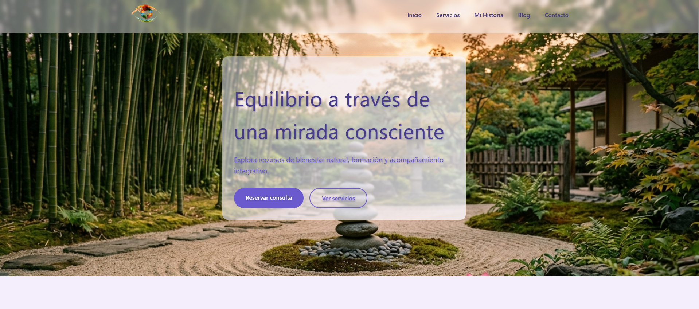
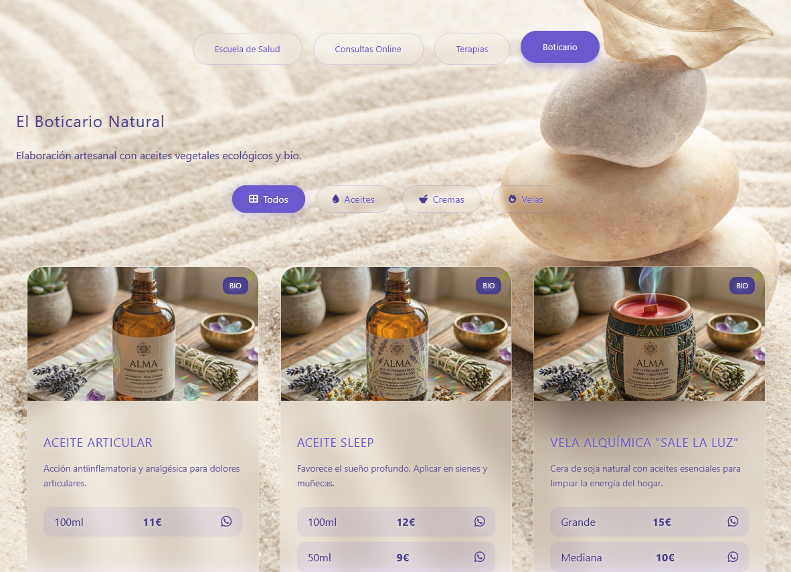
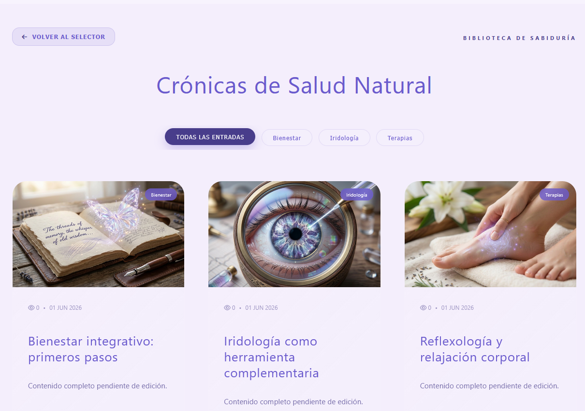
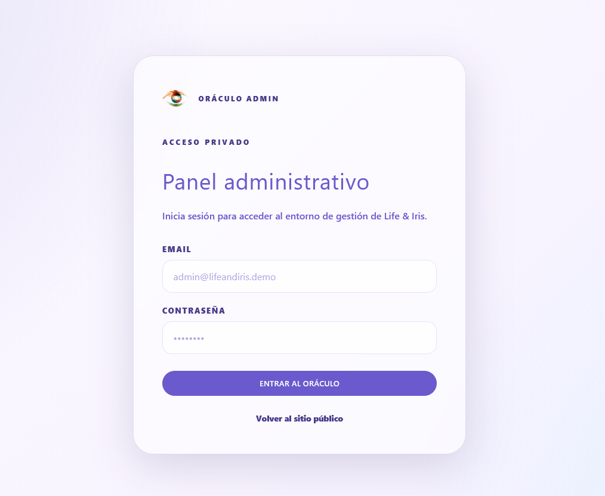
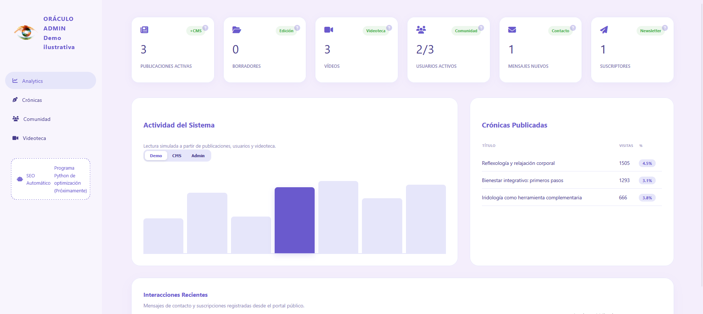
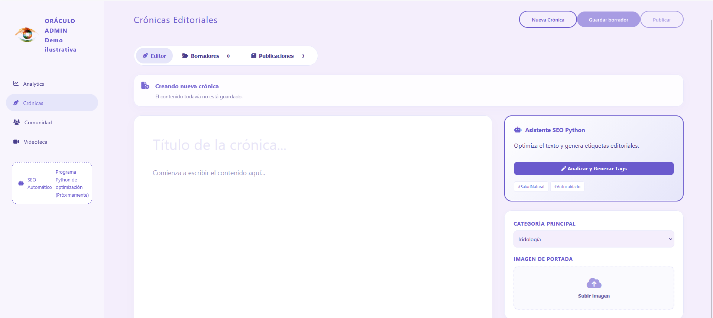
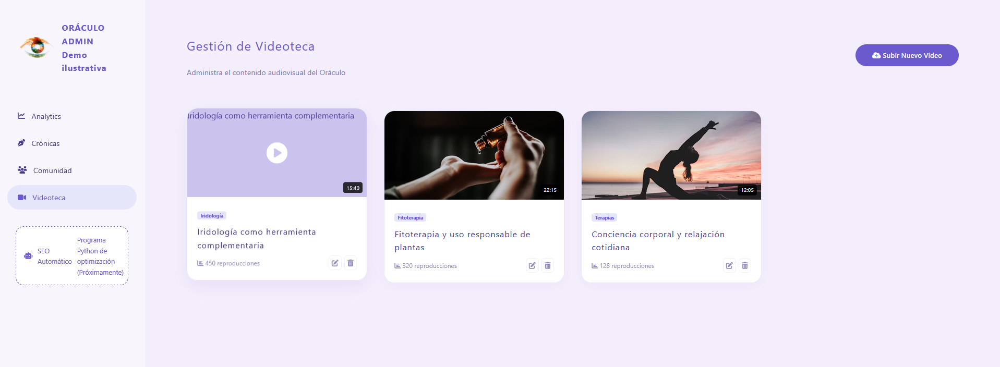
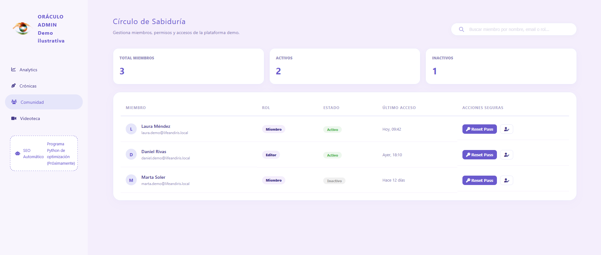

<div align="center">

# Life & Iris · Frontend

### Portal web premium + panel administrativo protegido para una marca real de bienestar integrativo



<br />


\

<br />

[Demo online](https://life-iris-demo.netlify.app/) ·
[API Backend](https://demo-app-salud-api.onrender.com/api/salud) ·
[Repositorio Backend](https://github.com/Wester01/demo-app-salud-api) ·
[Portfolio](https://wester-dev.es)

</div>

---

## Descripción

**Life & Iris** es una aplicación web desarrollada con **Angular** para una marca real del sector bienestar. El proyecto combina un portal público de presentación con un panel privado de administración llamado **Oráculo Admin**.

El objetivo principal del proyecto es mostrar una experiencia frontend completa, cuidada visualmente, responsive y preparada para integrarse con backend real. Actualmente, el acceso al panel administrativo está protegido mediante autenticación JWT conectada a una API desplegada en Render.

---

## Objetivos del proyecto

* Crear una web pública elegante, responsive y orientada a marca.
* Diseñar un panel administrativo privado con módulos funcionales.
* Implementar autenticación real para proteger la zona `/oraculo`.
* Mantener una demo segura sin exponer datos reales del cliente.
* Desplegar frontend, backend y base de datos en servicios cloud.
* Documentar una arquitectura full stack clara y defendible en portfolio.

---

## Demo

La aplicación está desplegada en Netlify:

```txt
https://life-iris-demo.netlify.app/
```

Rutas principales:

```txt
/                     Página de inicio
/servicios            Servicios y formulario de consulta
/sobre-mi             Historia / presentación del proyecto
/contacto             Formulario de contacto
/blog                 Entrada principal del blog
/blog/articulos       Listado de artículos
/videoteca            Videoteca pública
/oraculo/login        Login privado del panel admin
/oraculo              Panel administrativo protegido
```

---

## Stack técnico

### Frontend

| Tecnología                   | Uso                                        |
| ---------------------------- | ------------------------------------------ |
| Angular                      | Framework principal                        |
| TypeScript                   | Tipado estático                            |
| SCSS                         | Estilos modulares por componente           |
| Angular Router               | Rutas públicas y privadas                  |
| Reactive Forms / FormsModule | Formularios                                |
| HttpClient                   | Comunicación con API                       |
| Signals                      | Estado reactivo en componentes y servicios |
| LocalStorage                 | Persistencia controlada para módulos demo  |
| Netlify                      | Despliegue frontend                        |

### Backend relacionado

| Tecnología | Uso                  |
| ---------- | -------------------- |
| Node.js    | Runtime backend      |
| Express    | API REST             |
| Prisma 7   | ORM                  |
| PostgreSQL | Base de datos        |
| Neon       | Hosting PostgreSQL   |
| Render     | Despliegue backend   |
| JWT        | Autenticación        |
| bcrypt     | Hash de credenciales |
| Zod        | Validación           |

Repositorio backend:

```txt
https://github.com/Wester01/demo-app-salud-api
```

---

## Funcionalidades principales

### Portal público

* Home premium con estética visual personalizada.
* Sección de servicios con tabs responsive.
* Formularios de contacto y consulta.
* Blog público con artículos navegables.
* Videoteca pública.
* Página de historia / presentación.
* Responsive completo para móvil, tablet y escritorio.
* Scroll restoration y rutas SPA compatibles con Netlify.

### Panel Oráculo Admin

* Login real contra API backend.
* Protección de rutas privadas mediante guard.
* Persistencia de sesión mediante JWT.
* Cierre de sesión.
* Dashboard de analytics.
* Editor de crónicas.
* Gestión de videoteca.
* Gestión de comunidad.
* Interacciones recientes.
* Modo demo seguro para CRUD internos.

---

## Autenticación

El acceso a `/oraculo` está protegido mediante un flujo real de autenticación:

```txt
Angular Login
→ POST /api/auth/login
→ API valida credenciales
→ API devuelve JWT
→ Angular guarda token
→ Guard protege rutas privadas
→ GET /api/auth/perfil valida sesión
```

El panel administrativo no es público. Las credenciales no se publican en el repositorio.

---

## Qué es real y qué es demo

Este proyecto combina integración real con comportamiento demo controlado.

### Implementado con backend real

* Login administrativo.
* Token JWT.
* Validación de perfil.
* Protección de rutas.
* API desplegada en Render.
* Base de datos PostgreSQL en Neon.
* Usuario administrador persistido en base de datos.

### Simulado en frontend para demo

* Crónicas del panel.
* Vídeos del panel.
* Comunidad.
* Métricas internas.
* Interacciones administrativas.

Estos módulos usan `localStorage` de forma intencionada para mantener una demo interactiva sin exponer información real del cliente ni depender de datos productivos.

---

## Capturas

### Portal público

<p align="center">
  
</p>

<p align="center">
  
</p>

<p align="center">
  
</p>

<p align="center">
  
</p>

### Oráculo Admin

<p align="center">
  
</p>

<p align="center">
  
</p>

<p align="center">
  
</p>

<p align="center">
  
</p>

<p align="center">
  
</p>

---

## Arquitectura frontend

Estructura principal del proyecto:

```txt
src/
├─ app/
│  ├─ compartido/
│  │  ├─ componentes/
│  │  └─ layouts/
│  ├─ modulos/
│  │  ├─ admin/
│  │  ├─ blog/
│  │  ├─ contacto/
│  │  ├─ inicio/
│  │  ├─ servicios_negocio/
│  │  ├─ sobre-mi/
│  │  └─ videoteca/
│  ├─ nucleo/
│  │  ├─ config/
│  │  ├─ guards/
│  │  ├─ interceptores/
│  │  ├─ modelos/
│  │  └─ servicios/
│  ├─ app.config.ts
│  └─ app.routes.ts
```

---

## Decisiones técnicas destacadas

### Separación de layouts

El sitio público y el panel administrativo usan layouts separados:

```txt
LayoutPublicoComp
→ navegación pública
→ footer
→ rutas públicas

AdminLayoutComp
→ sidebar privado
→ rutas admin
→ logout
```

Esto evita mezclar navegación pública con el panel privado.

### Rutas privadas

El bloque `/oraculo` está protegido con guard:

```txt
/oraculo/login    público
/oraculo/*        privado
```

Si no existe token o el perfil no es válido, el usuario es redirigido al login.

### Demo controlada con LocalStorage

El panel mantiene interactividad real en el navegador sin exponer datos productivos. Esta decisión permite enseñar flujos de edición, publicación, borradores y métricas sin comprometer información sensible.

### Backend desacoplado

La API está desplegada de forma independiente en Render. El frontend consume únicamente los endpoints necesarios para autenticación.

---

## Instalación local

Clonar el repositorio:

```bash
git clone https://github.com/Wester01/demo-app-salud.git
cd demo-app-salud
```

Instalar dependencias:

```bash
npm install
```

Ejecutar en desarrollo:

```bash
ng serve
```

Abrir:

```txt
http://localhost:4200
```

---

## Build

Generar build de producción:

```bash
ng build
```

El proyecto está configurado para desplegarse en Netlify mediante `netlify.toml`.

---

## Configuración Netlify

Archivo usado:

```txt
netlify.toml
```

Configuración principal:

```toml
[build]
  command = "npm run build"
  publish = "dist/app-salud-holistica/browser"

[build.environment]
  NODE_VERSION = "22"

[[redirects]]
  from = "/*"
  to = "/index.html"
  status = 200
```

El redirect permite que rutas internas de Angular funcionen al refrescar o escribir directamente una URL como:

```txt
/oraculo
/blog/articulos
/videoteca
```

---

## Seguridad y privacidad

* El repositorio no contiene archivos `.env` reales.
* No se publican credenciales administrativas.
* El acceso a Oráculo está protegido mediante JWT.
* La marca y elementos visuales de Life & Iris se usan con autorización del cliente.
* Datos administrativos, métricas, usuarios e interacciones son ficticios o adaptados para demo.
* El rostro y referencias personales sensibles han sido retirados o sustituidos.

---

## Estado del proyecto

```txt
Frontend público: completado
Responsive: completado
Panel admin: completado
Login real: completado
Logout: completado
Backend conectado: completado
Despliegue Netlify: completado
Documentación: en progreso
```

---

## Roadmap

Posibles mejoras futuras:

* Sustituir progresivamente módulos demo por endpoints reales.
* Añadir CRUD real de crónicas.
* Añadir CRUD real de videoteca.
* Añadir subida de imágenes.
* Añadir roles avanzados.
* Añadir tests unitarios.
* Añadir documentación visual extendida.
* Añadir Swagger público del backend.
* Añadir modo demo con credenciales temporales.

---

## Autor

Desarrollado por Wester Dev

* Portfolio: https://wester-dev.es
* GitHub: https://github.com/Wester01

---

<div align="center">

### Wester Dev

Frontend cuidado, backend funcional y documentación clara para productos digitales modernos.

\

</div>
